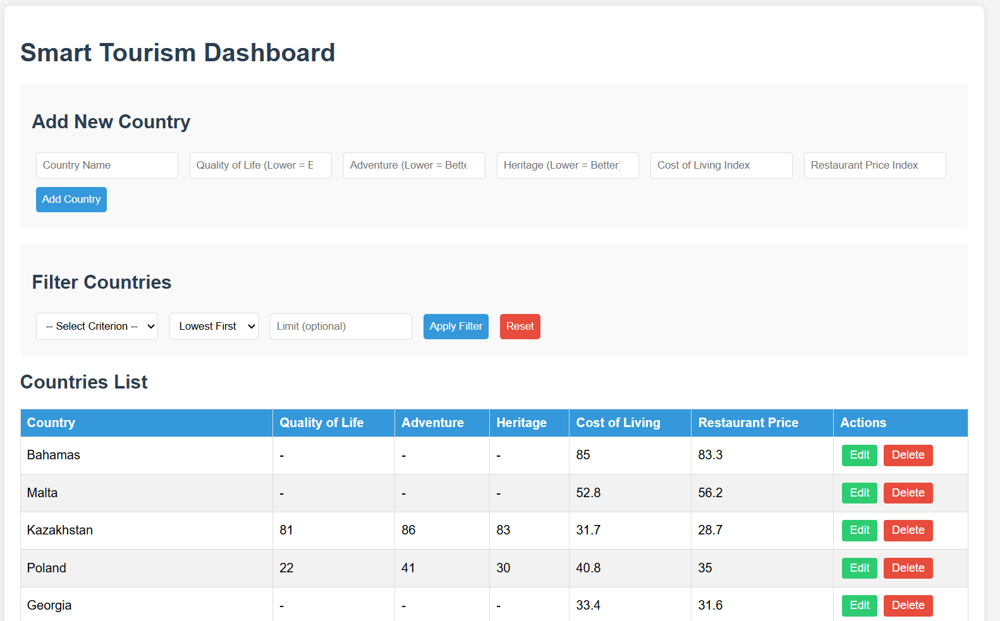
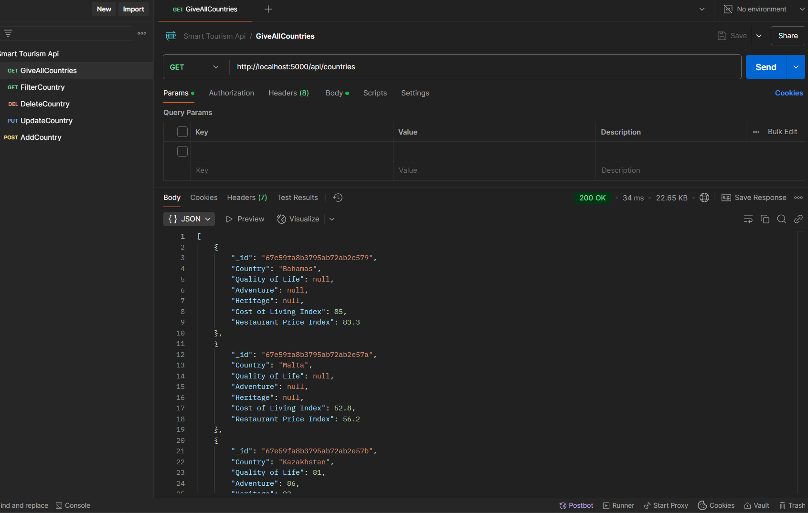
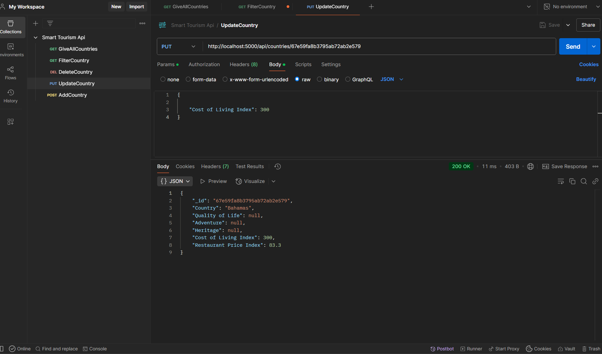
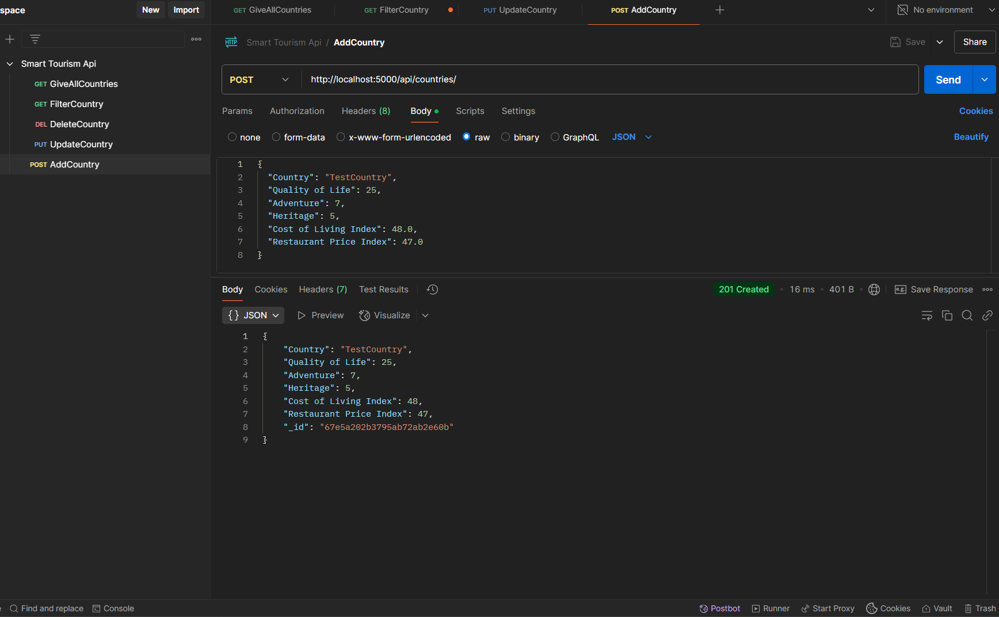

# Smart Tourism API
test1
A full-stack JavaScript application for managing country tourism data with MongoDB and Express.

## Features

- RESTful API endpoints for CRUD operations
- Advanced filtering and sorting capabilities
- Dockerized MongoDB database
- MVC architecture
- Environment variable configuration
- Ready-to-use Postman collection   

## Prerequisites

- Node.js 
- npm 
- Docker (for running MongoDB and the app)

#### Project Structure

```
smart-tourism-api/
├── config/           # DB configuration
├── controllers/      # Business logic
├── data/             # Sample JSON data
├── models/           # Mongoose schemas
├── public/           # Frontend assets
│   ├── index.html
│   ├── style.css
│   └── script.js
├── routes/           # API endpoints
└── server.js         # Entry point
```


# Installation & Running the Application

There are two ways to test the application:  
1. Using the UI  
2. Using the Postman Collection  

## 1. Run the Application and Use the UI  

To run the application and access the user interface, follow these steps:  

- Ensure Docker is running.  
- Start the application using Docker Compose:  

    ```
    docker-compose up -d --build
    ```

- Once the application is running, you can access the UI at:  

    ```
    http://localhost:5000
    ```
    

## 2. Use Postman Collection  

If you prefer to test the API directly, you can use Postman.  

### Postman Collection  

- Start the app 
    ```
    docker-compose up -d --build
    ```
- Import the following collection into Postman:  

    **`Smart_Tourism_API.postman_collection.json`**  

- Use the predefined requests to test the available API endpoints.  

    

    

    


  


